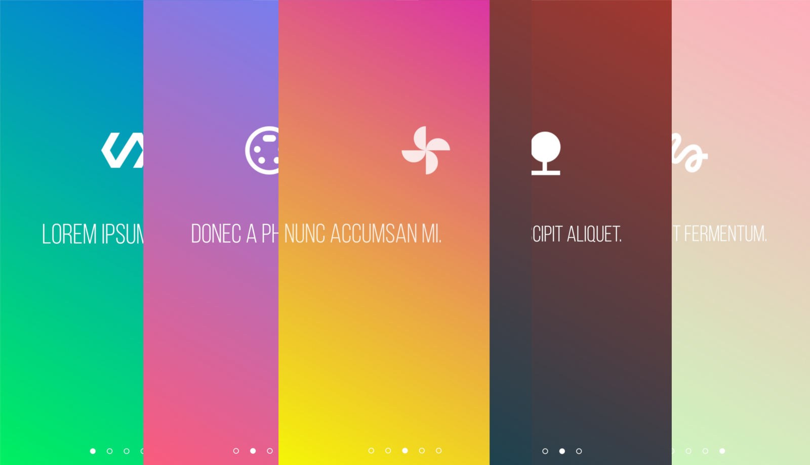

# _androidstudio_-IntroTabScreen
Sample introductory tabbed screen with animations, built with Android Studio.

## Introduction

Application introduction screens are becoming an increasingly common practice in mobile app development, as they offer simple and interactive tutorials for users. This package offers a 5-page tab screen template, with animations.

## How to Use

- Animations
  - Animations are controlled by the 'IntroPageTransformer' class
- Tab Indicator
  - Tab indicator layouts are stored in res/drawable subdirectory

